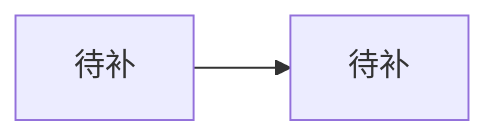

# 设计总览

给人看的首页：这个项目想做什么、怎么做到、有哪些功能。手写；不出现代码名（文件名、函数名、类名）。

## 意图

待补

## 原理

```mermaid
flowchart LR
  A[待补] --> B[待补]
```

待补：几句话讲这张图。

## 功能

- 待补

## 全部文档

<!-- GEN:docs-index BEGIN -->
<!-- GEN:docs-index END -->
